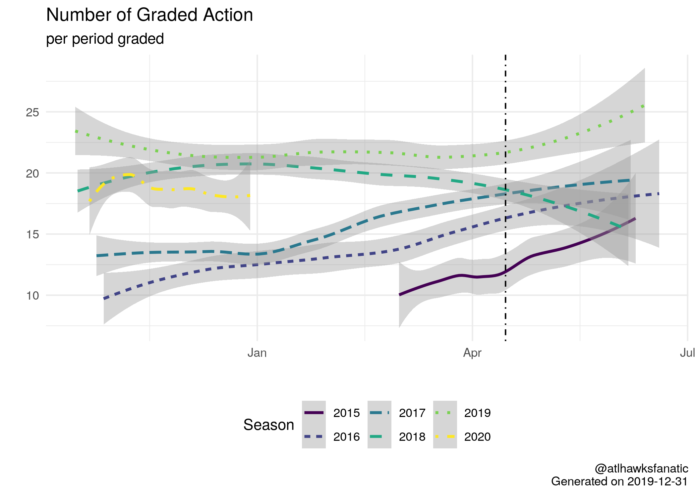

# L2M

## Articles

- [How To Extract The Last Two Minute Reports](2-eda/2-how-to-last-two-minutes)
- [Updating The Last Two Minute Reports: data through the 2019 NBA Finals]((2-eda/2-through-2019-finals))

## Description

This repository is meant as a way to maintain the Last Two Minute (L2M) reports that the NBA releases for certain NBA games. The clean, processed version of the data can be found in [1-tidy/L2M/L2M.csv](1-tidy/L2M/L2M.csv) while the corresponding `R` code to create this data is scattered across the [0-data](0-data) and [1-tidy](1-tidy) folders. The [0-data/L2M/](0-data/L2M/) folder hosts the raw data (in pdf form).

The process for compiling the L2M dataset is to:

1. Download the raw data, these are broken up into the different years which the NBA has collected L2M:
    - [Archived](0-data/0-L2M-download-archive.R) which begins on 1 March 2015 and goes through the 2017 NBA Finals.
    - [2017-18](0-data/0-L2M-download-2017-18.R)
    - [2018-19](0-data/0-L2M-download-2018-19.R) - which changes formats to online only after the 2019 NBA All Star Game (February 21, 2019 is the first). This requires the [splashr](https://github.com/hrbrmstr/splashr) package to handle scraping of the NBA website.
    - [2019-20](0-data/0-L2M-download-2019-20.R) - current season and so far no PDFs. [splashr](https://github.com/hrbrmstr/splashr) package required.
2. Read in the pdf files through the [pdftools](https://github.com/ropensci/pdftools) package:
    - [Archived](0-data/0-L2M-pdftools-archive.R)
    - [2017-18](0-data/0-L2M-pdftools-2017-18.R)
    - [2018-19](0-data/0-L2M-pdftools-2018-19.R)
    - None for 2019-20 at the moment.
3. Download box scores for games from <basketball-reference.com> for score and rosters to match up committing/disadvantaged players.
    - [File](0-data/0-bkref-data.R) depends on .rds files created in step 2 to be present in directory.
4. Combine L2M reports with box score information
    - [Raw version](1-tidy/1-L2M-raw.R) which does not include box score info, the [csv file](1-tidy/L2M/L2M_raw.csv)
    - [Final version](1-tidy/1-L2M-bkref.R) which includes box score info, the [csv file](1-tidy/L2M/L2M.csv)

The final [output](1-tidy/L2M/L2M.csv) includes the following variables:

- `period`: period at which point the play occurred
- `time`: time remaining in the period when play occurred
- `call_type`: raw call type variable in L2M
- `committing`: committing player or team in L2M, may be blank
- `disadvantaged`: disadvantaged player or team in L2M, may be blank
- `decision`: judgement of L2M for the call, could be CC, CNC, IC, INC, or blank
- `comments`: L2M comments on the play
- `game_details`: game details on L2M
- `page`: page of L2M for pdf
- `file`: name of L2M file, will be NA for scraped data
- `game_date`: game date according to L2M report header
- `away_team`: away team name
- `home_team`: home team name
- `call`: first part of call_type, this is before the colon in call_type
- `type `: second part of call_type, this is after the colon in call_type
- `date`: date of game in YYYY-MM-DD format
- `away`: away team abbreviation
- `home`: home team abbreviation
- `scrape_time`: time that NBA website was scraped for L2M
- `stint`: stint which indicates when a set of plays roughly occurred, only available for scraped data
- `home_bkref`: home team abbreviation according to basketball-reference
- `bkref_id`: game id for basketball-reference
- `ref_1`: name of first referee for game
- `ref_2`: name of second referee for game
- `ref_3`: name of third referee for game
- `attendance`: attendance for the game
- `committing_min`: total minutes played by player committing action (note, may be NA because the player did not play and likely an input error from NBA on L2M)
- `committing_team`: team for committing player
- `committing_side`: home/away for committing player
- `disadvantaged_min`: total minutes played by player disadvantaged by action
- `disadvantaged_team`: team for disadvantaged player
- `disadvantaged_side`: home/away for disadvantaged player
- `type2`: consistent format for type of infraction
- `time_min`: minutes remaining in period
- `time_sec`: seconds remaining in period
- `time2`: fractional minutes left (ie 1.9 would be one minute and 54 seconds)
- `season`: NBA season for which the graded play was a part of, convention is to use the last year of the NBA season so 2015 refers to the 2014-15 Season
- `playoffs`: dummy variable equal to 1 if the game occurred in the playoffs

And an overview of the changes in L2M reporting is provided in [2-eda/2-through-2019-finals](2-eda/2-through-2019-finals). Further, there is a bit of a how-to for downloading and extracting data on the L2M that is provided in [2-eda/2-how-to-last-two-minutes](2-eda/2-how-to-last-two-minutes)