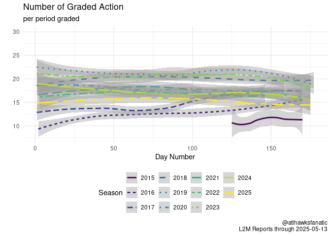

<!-- README.md is generated from README.Rmd. Please edit README.Rmd for corrections file -->

# L2M

## Articles

-   [How To Extract The Last Two Minute
    Reports](2-eda/2-how-to-last-two-minutes)
-   [Updating The Last Two Minute Reports: data through the 2019 NBA
    Finals](2-eda/2-through-2019-finals)

## Description

This repository is meant as a way to maintain the [Last Two Minute (L2M)
reports](https://official.nba.com/2020-21-nba-officiating-last-two-minute-reports/)
that the NBA releases for certain NBA games. The clean, processed
version of the data can be found in
[1-tidy/L2M/L2M.csv](1-tidy/L2M/L2M.csv) while the corresponding `R`
code to create this data is scattered across the [0-data](0-data) and
[1-tidy](1-tidy) folders. The [0-data/L2M/](0-data/L2M/) folder hosts
the raw data (in pdf form).

<!-- -->

| Season | Games | Grades per period | Calls per period | IC per period | CC Percentage | INC per period | Bad Calls Percentage | CNC per period |
|:------:|:-----:|:-----------------:|:----------------:|:-------------:|:-------------:|:--------------:|:--------------------:|:--------------:|
|  2015  |  139  |       11.27       |       4.82       |     0.15      |      97%      |      1.37      |         25%          |      5.08      |
|  2016  |  439  |       12.88       |       4.77       |     0.21      |      96%      |      1.66      |         29%          |      6.45      |
|  2017  |  428  |       15.00       |       4.15       |     0.08      |      98%      |      2.49      |         39%          |      8.36      |
|  2018  |  475  |       19.67       |       4.14       |     0.12      |      97%      |      2.46      |         39%          |     13.07      |
|  2019  |  453  |       21.30       |       3.63       |     0.14      |      96%      |      2.54      |         43%          |     15.12      |
|  2020  |  389  |       18.07       |       3.79       |     0.15      |      96%      |      1.08      |         25%          |     13.19      |
|  2021  |  404  |       17.20       |       3.85       |     0.19      |      95%      |      0.87      |         22%          |     12.48      |

All games with L2M Call Accuracy updated through 2021-07-14

| Season | Playoffs | Games | Grades per period | Calls per period | IC per period | CC Percentage | INC per period | Bad Calls Percentage | CNC per period |
|:------:|:--------:|:-----:|:-----------------:|:----------------:|:-------------:|:-------------:|:--------------:|:--------------------:|:--------------:|
|  2015  |  FALSE   |  113  |       10.74       |       4.84       |     0.15      |      97%      |      1.36      |         24%          |      4.54      |
|  2015  |   TRUE   |  26   |       13.40       |       4.74       |     0.14      |      97%      |      1.43      |         25%          |      7.23      |
|  2016  |  FALSE   |  410  |       12.58       |       4.81       |     0.21      |      96%      |      1.58      |         28%          |      6.18      |
|  2016  |   TRUE   |  29   |       17.26       |       4.12       |     0.18      |      96%      |      2.82      |         43%          |     10.32      |
|  2017  |  FALSE   |  403  |       14.81       |       4.14       |     0.08      |      98%      |      2.46      |         38%          |      8.21      |
|  2017  |   TRUE   |  25   |       18.29       |       4.18       |     0.04      |      99%      |      3.07      |         43%          |     11.04      |
|  2018  |  FALSE   |  452  |       19.79       |       4.14       |     0.11      |      97%      |      2.47      |         39%          |     13.18      |
|  2018  |   TRUE   |  23   |       17.35       |       4.12       |     0.23      |      94%      |      2.42      |         41%          |     10.81      |
|  2019  |  FALSE   |  422  |       21.19       |       3.66       |     0.14      |      96%      |      2.57      |         43%          |     14.97      |
|  2019  |   TRUE   |  31   |       22.67       |       3.33       |     0.15      |      95%      |      2.21      |         43%          |     17.13      |
|  2020  |  FALSE   |  364  |       17.89       |       3.80       |     0.15      |      96%      |      1.09      |         25%          |     13.01      |
|  2020  |   TRUE   |  25   |       20.50       |       3.67       |     0.13      |      96%      |      1.03      |         25%          |     15.80      |
|  2021  |  FALSE   |  379  |       17.13       |       3.82       |     0.18      |      95%      |      0.84      |         22%          |     12.48      |
|  2021  |   TRUE   |  25   |       18.10       |       4.30       |     0.30      |      93%      |      1.23      |         28%          |     12.57      |

L2M Call Accuracy updated through 2021-07-14

The process for compiling the L2M dataset is to:

1.  Download the raw data, these are broken up into the different years
    which the NBA has collected L2M:
    -   [Archived](0-data/0-L2M-download-archive.R) which begins on 1
        March 2015 and goes through the 2017 NBA Finals.
    -   [2017-18](0-data/0-L2M-download-2017-18.R)
    -   [2018-19](0-data/0-L2M-download-2018-19.R) - which changes
        formats to online only after the 2019 NBA All Star Game
        (February 21, 2019 is the first). This requires the
        [splashr](https://github.com/hrbrmstr/splashr) package to handle
        scraping of the NBA website.
    -   [2019-20](0-data/0-L2M-download-2019-20.R) - almost exclusively
        online with only a few PDF games. Use of the
        [splashr](https://github.com/hrbrmstr/splashr) package is
        required.
    -   [2020-21](0-data/0-L2M-download-2020-21.R) - current season and
        so far no PDFs. [splashr](https://github.com/hrbrmstr/splashr)
        package required.
2.  Read in the pdf files through the
    [pdftools](https://github.com/ropensci/pdftools) package:
    -   [Archived](0-data/0-L2M-pdftools-archive.R)
    -   [2017-18](0-data/0-L2M-pdftools-2017-18.R)
    -   [2018-19](0-data/0-L2M-pdftools-2018-19.R)
    -   [2019-20](0-data/0-L2M-pdftools-2019-20.R)
    -   None for 2020-21 at the moment.
3.  Download box scores for games from
    [basketball-reference.com](https://www.basketball-reference.com/)
    for score and rosters to match up committing/disadvantaged players.
    -   [File](0-data/0-bkref-data.R) depends on .rds files created in
        step 2 to be present in directory.
4.  Combine L2M reports with box score information
    -   [Raw version](1-tidy/1-L2M-raw.R) which does not include box
        score info, the [csv file](1-tidy/L2M/L2M_raw.csv)
    -   [Final version](1-tidy/1-L2M-bkref.R) which includes box score
        info, the [csv file](1-tidy/L2M/L2M.csv)

The final [output](1-tidy/L2M/L2M.csv) includes the following variables:

-   `period`: period at which point the play occurred
-   `time`: time remaining in the period when play occurred
-   `call_type`: raw call type variable in L2M
-   `committing`: committing player or team in L2M, may be blank
-   `disadvantaged`: disadvantaged player or team in L2M, may be blank
-   `decision`: judgment of L2M for the call, could be CC, CNC, IC, INC,
    or blank where CC = Correct Call, CNC = Correct Non-Call, IC =
    Incorrect Call, INC = Incorrect Non-Call and blank = not detectable
    without technology
-   `comments`: L2M comments on the play
-   `game_details`: game details on L2M
-   `page`: page of L2M for pdf
-   `file`: name of L2M file, will be NA for scraped data
-   `game_date`: game date according to L2M report header
-   `away_score`: away final score from the L2M reports, incomplete
    variable
-   `away_team`: away team name
-   `home_score`: home final score from the L2M reports, incomplete
    variable
-   `home_team`: home team name
-   `call`: first part of call\_type, this is before the colon in
    call\_type
-   `type`: second part of call\_type, this is after the colon in
    call\_type
-   `date`: date of game in YYYY-MM-DD format
-   `home`: home team abbreviation
-   `away`: away team abbreviation
-   `scrape_time`: time that NBA website was scraped for L2M
-   `stint`: stint which indicates when a set of plays roughly occurred,
    only available for scraped data
-   `game_id`: nba.com url for L2M game, last part of
    “<https://official.nba.com/l2m/L2MReport.html/>”
-   `home_bkref`: home team abbreviation according to
    basketball-reference
-   `bkref_id`: game id for basketball-reference
-   `nba_game_id`: NBA API game ID, based off of `game_id`
-   `ref_1`: name of first referee for game
-   `ref_2`: name of second referee for game
-   `ref_3`: name of third referee for game
-   `attendance`: attendance for the game
-   `committing_min`: total minutes played by player committing action
    (note, may be NA because the player did not play and likely an input
    error from NBA on L2M)
-   `committing_team`: team for committing player
-   `committing_side`: home/away for committing player
-   `disadvantaged_min`: total minutes played by player disadvantaged by
    action
-   `disadvantaged_team`: team for disadvantaged player
-   `disadvantaged_side`: home/away for disadvantaged player
-   `type2`: consistent format for type of infraction
-   `time_min`: minutes remaining in period
-   `time_sec`: seconds remaining in period
-   `time2`: fractional minutes left (ie 1.9 would be one minute and 54
    seconds)
-   `season`: NBA season for which the graded play was a part of,
    convention is to use the last year of the NBA season so 2015 refers
    to the 2014-15 Season
-   `playoff`: dummy variable equal to `TRUE` if the game occurred in
    the playoffs

And an overview of the changes in L2M reporting is provided in
[2-eda/2-through-2019-finals](2-eda/2-through-2019-finals). Further,
there is a bit of a how-to for downloading and extracting data on the
L2M that is provided in
[2-eda/2-how-to-last-two-minutes](2-eda/2-how-to-last-two-minutes)
