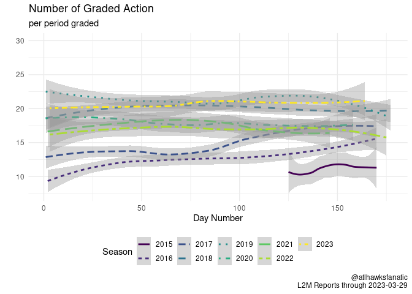

<!-- README.md is generated from README.Rmd. Please edit README.Rmd for corrections file -->

# L2M

## Articles

-   [How To Extract The Last Two Minute
    Reports](2-eda/2-how-to-last-two-minutes)
-   [Updating The Last Two Minute Reports: data through the 2019 NBA
    Finals](2-eda/2-through-2019-finals)

## Description

This repository maintains the [Last Two Minute (L2M)
reports](https://official.nba.com/2021-22-nba-officiating-last-two-minute-reports/)
that the NBA releases for some NBA games depending on how close the game
was in the final two minutes. The clean, processed version of the data
can be found in
[1-tidy/L2M/L2M-stats-nba.csv](1-tidy/L2M/L2M-stats-nba.csv) while the
corresponding [`R`](https://www.r-project.org/) code to create this data
is scattered across the [0-data](0-data) and [1-tidy](1-tidy) folders.
The [0-data/L2M/archived-pdf](0-data/L2M/archived-pdf) folder hosts the
raw pdf data from the games before the NBA utilized an API for storing
L2M information. The
[0-data/official_nba/raw/l2m-api](0-data/official_nba/raw/l2m-api)
folder hosts individual game files from the API.

<!-- -->

| Season | Games | Grades per period | Calls per period | IC per period | CC Percentage | INC per period | Bad Calls Percentage | CNC per period |
|:------:|:-----:|:-----------------:|:----------------:|:-------------:|:-------------:|:--------------:|:--------------------:|:--------------:|
|  2015  |  139  |       11.27       |       4.82       |     0.15      |      97%      |      1.37      |         25%          |      5.08      |
|  2016  |  439  |       12.88       |       4.77       |     0.21      |      96%      |      1.66      |         29%          |      6.45      |
|  2017  |  428  |       15.00       |       4.15       |     0.08      |      98%      |      2.49      |         39%          |      8.36      |
|  2018  |  475  |       19.67       |       4.14       |     0.12      |      97%      |      2.46      |         39%          |     13.07      |
|  2019  |  455  |       21.28       |       3.59       |     0.13      |      96%      |      2.55      |         44%          |     15.14      |
|  2020  |  389  |       18.05       |       3.79       |     0.15      |      96%      |      1.08      |         25%          |     13.18      |
|  2021  |  405  |       17.18       |       3.85       |     0.19      |      95%      |      0.87      |         22%          |     12.47      |
|  2022  |  441  |       17.53       |       4.18       |     0.19      |      95%      |      1.18      |         26%          |     12.18      |
|  2023  |  412  |       20.76       |       4.37       |     0.16      |      96%      |      1.16      |         24%          |     15.24      |

All games with L2M Call Accuracy updated through 2023-03-28

| Season | Playoffs | Games | Grades per period | Calls per period | IC per period | CC Percentage | INC per period | Bad Calls Percentage | CNC per period |
|:------:|:--------:|:-----:|:-----------------:|:----------------:|:-------------:|:-------------:|:--------------:|:--------------------:|:--------------:|
|  2015  |  FALSE   |  113  |       10.74       |       4.84       |     0.15      |      97%      |      1.36      |         24%          |      4.54      |
|  2015  |   TRUE   |  26   |       13.40       |       4.74       |     0.14      |      97%      |      1.43      |         25%          |      7.23      |
|  2016  |  FALSE   |  410  |       12.58       |       4.81       |     0.21      |      96%      |      1.58      |         28%          |      6.18      |
|  2016  |   TRUE   |  29   |       17.26       |       4.12       |     0.18      |      96%      |      2.82      |         43%          |     10.32      |
|  2017  |  FALSE   |  403  |       14.81       |       4.14       |     0.08      |      98%      |      2.46      |         38%          |      8.21      |
|  2017  |   TRUE   |  25   |       18.29       |       4.18       |     0.04      |      99%      |      3.07      |         43%          |     11.04      |
|  2018  |  FALSE   |  452  |       19.79       |       4.14       |     0.11      |      97%      |      2.47      |         39%          |     13.18      |
|  2018  |   TRUE   |  23   |       17.35       |       4.12       |     0.23      |      94%      |      2.42      |         41%          |     10.81      |
|  2019  |  FALSE   |  424  |       21.18       |       3.61       |     0.13      |      96%      |      2.57      |         44%          |     14.99      |
|  2019  |   TRUE   |  31   |       22.67       |       3.33       |     0.15      |      95%      |      2.21      |         43%          |     17.13      |
|  2020  |  FALSE   |  364  |       17.88       |       3.80       |     0.15      |      96%      |      1.08      |         25%          |     13.00      |
|  2020  |   TRUE   |  25   |       20.50       |       3.67       |     0.13      |      96%      |      1.03      |         25%          |     15.80      |
|  2021  |  FALSE   |  379  |       17.13       |       3.82       |     0.18      |      95%      |      0.84      |         22%          |     12.48      |
|  2021  |   TRUE   |  26   |       17.87       |       4.26       |     0.29      |      93%      |      1.26      |         28%          |     12.35      |
|  2022  |  FALSE   |  412  |       17.31       |       4.16       |     0.19      |      95%      |      1.17      |         25%          |     11.98      |
|  2022  |   TRUE   |  29   |       21.17       |       4.47       |     0.23      |      95%      |      1.33      |         27%          |     15.37      |
|  2023  |  FALSE   |  412  |       20.76       |       4.37       |     0.16      |      96%      |      1.16      |         24%          |     15.24      |

L2M Call Accuracy updated through 2023-03-28

### Organization

The process for compiling the L2M dataset is to:

1.  Download the raw data, either from the older PDF system or through
    their API:
    -   [Game IDs](0-data/stats_nba) from when the L2M began in 2014.
        Downloaded with
        [0-stats-nba-game-ids.R](0-data/0-stats-nba-game-ids.R) and
        [0-stats-nba-game-ids-pre-2015.R](0-data/0-stats-nba-game-ids-pre-2015.R).
        These provide the list of games that potentially could contain
        an L2M.
    -   [Archived PDFs](0-data/L2M/archived-pdf) where the
        [0-L2M-download-archive-updated.R](0-data/0-L2M-download-archive-updated.R)
        file downloads all the PDFs then
        [0-L2M-pdftools-archived-pdf.R](0-data/0-L2M-pdftools-archived-pdf.R)
        will parse through the information with the
        [pdftools](https://github.com/ropensci/pdftools) package. Output
        can be found
        [pdftools_L2M_archive_all.csv](0-data/L2M/archived-pdf/pdftools_L2M_archive_all.csv).
    -   [Official API](0-data/official_nba) contains data extracted from
        the API of official.nba.com. The
        [0-official-nba-l2m.R](0-data/0-official-nba-l2m.R) file
        accesses the API based on the previous day’s date and checking
        the games that have been played based on Game IDs. Output can be
        found
        [official_nba_l2m_api.csv](0-data/official_nba/official_nba_l2m_api.csv).
2.  Tidy up the raw L2M data
    -   [L2M Folder](1-tidy/L2M/) contains tidied data. First pass is
        through [1-L2M-raw-stats-nba.R](1-tidy/1-L2M-raw-stats-nba.R)
        which combines the PDF L2M reports with the L2M reports accessed
        through the API. Resulting output is
        [L2M_raw_api.csv](1-tidy/L2M/L2M_raw_api.csv).
3.  Download box scores for games from
    [stats.nba.com](https://stats.nba.com/) game information to
    supplement reports and to match up committing/disadvantaged players.
    -   [NBA Stats](0-data/stats_nba/) for both [box
        scores](0-data/0-stats-nba-box-data.R) and [play by
        play](0-data/0-stats-nba-pbp-data.R) data. Both utilize the
        NBA’s API for Stats, although there is no current use for the
        play by play data.
4.  Combine L2M reports with box score information
    -   [Raw version](1-tid1-L2M-raw-stats-nba.R) which does not include
        box score info, the [csv file](1-tidy/L2M_raw_api.csv)
    -   [Final version](1-tidy/1-L2M-stats-nba.R) which includes box
        score info, the [csv file](1-tidy/L2M/L2M_stats_nba.csv)

### Variables

The final [output](1-tidy/L2M/L2M_stats_nba.csv) includes the following
variables:

-   `period`: period at which point the play occurred
-   `time`: time remaining in the period when play occurred
-   `call_type`: raw call type variable in L2M
-   `committing`: committing player or team of the graded infraction in
    L2M, may be blank
-   `disadvantaged`: disadvantaged player or team of the graded
    infraction in L2M, may be blank
-   `decision`: judgment of L2M for the call, could be CC, CNC, IC, INC,
    or blank where CC = Correct Call, CNC = Correct Non-Call, IC =
    Incorrect Call, INC = Incorrect Non-Call and blank = not detectable
    without technology
-   `comments`: L2M comments on the play
-   `game_details`: game details of L2M, only relevant for PDFs
-   `page`: page of L2M for pdf, not applicable for games accessed
    through API
-   `file`: name of L2M file, will be the saved .csv file for API data
-   `game_date`: game date according to L2M report header
-   `away_team`: away team nickname
-   `home_team`: home team nickname
-   `date`: date of game in YYYY-MM-DD format
-   `call`: first part of call_type, this is before the colon in
    call_type
-   `type`: second part of call_type, this is after the colon in
    call_type
-   `home`: home team abbreviation
-   `away`: away team abbreviation
-   `gid`: NBA game ID
-   `gcode`: NBA game code
-   `home_score`: home final score from the L2M reports, incomplete
    variable
-   `away_score`: away final score from the L2M reports, incomplete
    variable
-   `national_tv`: national TV network for the game, “no” indicates none
-   `networks`: shorthand TV network for the game, NBALP indicates
    league pass
-   `game_id`: nba.com url for L2M game, last part of
    “<https://official.nba.com/l2m/L2MReport.html/>”, not applicable for
    PDFs
-   `PCTime`: from official API
-   `ImposibleIndicator`: from official API
-   `Difficulty`: from official API
-   `VideolLink`: from official API
-   `Qualifier`: from official API
-   `posID`: from official API
-   `posStart`: from official API
-   `posEnd`: from official API
-   `posTeamId`: from official API
-   `teamIdInFavor`: from official API
-   `errorInFavor`: from official API
-   `imgChart`: from official API
-   `GameId`: from official API
-   `GameDate`: from official API
-   `HomeTeamId`: from official API
-   `AwayTeamId`: from official API
-   `L2M_Comments`: from official API
-   `season`: NBA season for which the graded play was a part of,
    convention is to use the last year of the NBA season so 2015 refers
    to the 2014-15 Season
-   `playoff`: dummy variable equal to `TRUE` if the game occurred in
    the playoffs
-   `GAME_ID`: NBA API game ID, same as `gid`
-   `OFFICIAL_1`: name of first referee for game
-   `OFFICIAL_2`: name of second referee for game
-   `OFFICIAL_3`: name of third referee for game
-   `OFFICIAL_ID_1`: ID of first referee for game
-   `OFFICIAL_ID_2`: ID of second referee for game
-   `OFFICIAL_ID_3`: ID of third referee for game
-   `OFFICIAL_4`: name of fourth referee for game, typically only for
    playoff games
-   `OFFICIAL_ID_4`: ID of fourth referee for game, typically only for
    playoff games
-   `ATTENDANCE`: attendance for the game
-   `committing_min`: total minutes played by player committing action
    (note, may be NA because the player did not play and likely an input
    error from NBA on L2M)
-   `committing_team`: team for committing player
-   `committing_side`: home/away for committing player
-   `disadvantaged_min`: total minutes played by player disadvantaged by
    action
-   `disadvantaged_team`: team for disadvantaged player
-   `disadvantaged_side`: home/away for disadvantaged player
-   `type2`: consistent format for type of infraction
-   `time_min`: minutes remaining in period
-   `time_sec`: seconds remaining in period
-   `time2`: fractional minutes left (ie 1.9 would be one minute and 54
    seconds)

And an overview of the changes in L2M reporting is provided in
[2-eda/2-through-2019-finals](2-eda/2-through-2019-finals). Further,
there is a bit of a how-to for downloading and extracting data on the
L2M that is provided in
[2-eda/2-how-to-last-two-minutes](2-eda/2-how-to-last-two-minutes)
